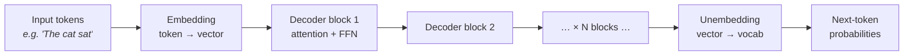
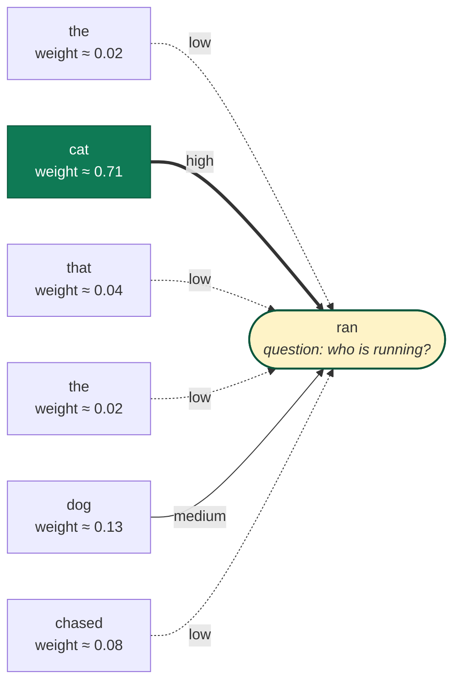

# LLM Fundamentals

This page is the deeper companion to [AI engineering fundamentals](/fundamentals/). It walks through what a large language model actually is, how it turns text into more text, and which details inside the model show up in real engineering decisions like cost, latency, accuracy, and prompt design.

If you only take one idea away from this page: an LLM is a program that has read an enormous amount of text and learned to predict, one token at a time, what should come next. Chatting with it, asking it to use tools, getting it to reason step by step — all of these are different ways of using that same prediction loop.

## 1. What an LLM is

A **large language model (LLM)** is a type of artificial intelligence program that can recognize and generate human language. LLMs are trained on huge collections of text — books, code, articles, conversations from the public web — which is where the word *large* in the name comes from. After training on enough examples, the model learns the statistical patterns of language well enough to write essays, answer questions, translate, summarize documents, and produce code [^cloudflare-llm].

Under the hood, an LLM is built on **machine learning**, and specifically on a kind of neural network called a **transformer** [^vaswani-2017]. A transformer is a stack of mathematical layers that learns which words (more precisely, which *tokens*) tend to follow which, given everything that came before. ChatGPT, Claude, Gemini, Llama, and Mistral are all transformer-based LLMs [^ibm-llm].

You can think of an LLM as a very sophisticated autocomplete:

1. You give it some text (the **prompt**).
2. The model looks at that text and predicts the most likely next token.
3. It adds that token to the text.
4. It repeats — using the new, longer text as the next input — until it decides to stop.

That repeated "predict the next token, add it, predict again" loop is called **autoregressive generation** [^stanford-cs224n]. The model is not retrieving sentences from a database and it is not "thinking" between calls. It is computing a probability distribution over a vocabulary of tens of thousands of possible next tokens and sampling from it.

A few consequences of this design that show up everywhere in engineering work:

- **No memory between calls.** Each request starts from scratch. Anything the model "remembers" about you, your project, or the conversation is text you put back into the prompt.
- **Output is probabilistic.** Run the same prompt twice and you can get different answers. Randomness comes from the *sampler* (see section 8), not from the model weights.
- **Quality depends on what's in the context.** The model can only use information that fits inside the current prompt. This is why prompt design, retrieval, and tool use matter so much.

The rest of this page unpacks how that loop actually works — how text becomes tokens, what the transformer does with them, how training gives the model its skills and its personality, and how decoding turns probabilities back into text.

## 2. Tokenization

<figure class="lesson-figure">
  
  <figcaption>
    Tokenization: raw text is split into subword tokens, each mapped to an integer ID before entering the model.
  </figcaption>
</figure>

Before the model can do anything with your text, it has to chop it up. LLMs do not read characters or whole words — they read **tokens**, which are short chunks of text (often parts of words). A tokenizer is a small program, trained alongside the model, that splits raw text into tokens and maps each one to a number the model can do math on. Common tokenization algorithms include **Byte-Pair Encoding (BPE)** and **SentencePiece** [^sennrich-bpe] [^kudo-sentencepiece].

Rules of thumb (English):

- ~4 characters per token, ~0.75 tokens per word
- "Hello world" → 2 tokens
- Code, JSON, URLs, non-English text → 1.5–3× more tokens per character
- Whitespace and punctuation are tokens too

The tokenizer is **part of the model**. You cannot swap it. Different model families count tokens differently — the same paragraph is 980 tokens in one tokenizer, 1,120 in another. Always count with the provider's tokenizer (`tiktoken`, Anthropic's `count_tokens` endpoint, etc.) before sizing prompts or RAG chunks.

Two practical traps:

- **Token boundaries break words.** `"unbelievable"` may be `["un", "believ", "able"]`. Regex on raw model output before decoding is a bug magnet.
- **Rare strings explode token counts.** Base64, hashes, long IDs cost far more than they look.

## 3. Transformer architecture (decoder-only)

The **transformer** is the kind of **neural network** behind modern LLMs. A neural network is a program made of many simple math operations stacked in layers; you feed numbers in at the top, they get transformed step by step, and predictions come out at the bottom. The network "learns" by adjusting millions (or billions) of internal numbers — called **weights** — until its predictions match real data [^ibm-neural-network]. The transformer is one specific recipe for arranging those layers, introduced in the 2017 paper *Attention Is All You Need* [^vaswani-2017]. Today every major chat model — GPT, Claude, Gemini, Llama, Mistral — is a transformer.

The diagram below is the standard "assembly line" view of one forward pass through the model:

What each step actually does:

1. **Embedding.** Every token (e.g., `"cat"`) is turned into a long list of numbers — its "meaning vector." Tokens with similar meanings end up with similar vectors. This is the token taking its seat at the table with a name tag.
2. **Decoder blocks.** The meaning vectors are passed through a stack of identical blocks. Each block has two main parts (covered in detail in the next section):
   - **Self-attention** — the "looking around the table" step. Lets each token gather information from earlier tokens.
   - **Feed-forward network (FFN)** — a small calculation applied to each token on its own. Think of it as the token *thinking* about what it just heard. This is where most of the model's stored knowledge lives.
   - Two extra tricks called **residual connections** and **layer normalization** are wrapped around both parts; they exist purely to make training stable. As an application engineer you can ignore them.
3. **Unembedding.** After all the blocks have run, the final vector of the *last* token is converted back into a list of probabilities — one number for every possible next token in the vocabulary.

A "frontier model" is just this same recipe at larger scale: more blocks stacked on top of each other, longer meaning vectors, more attention heads, far more training data. There is no secret extra ingredient.

The good news for you: **you almost never touch the architecture.** Building an LLM-powered product is about choosing a model and shaping what goes into it. Reading internals like the above only matters because it explains *why* the model behaves the way it does — why long prompts are expensive, why it loses focus in giant contexts, why it sometimes confidently makes things up. The next sections connect each behavior back to the picture above.

## 4. Self-attention in plain terms

Self-attention is the "looking around the table" step from the previous section. It is the single most important idea in the transformer, so it's worth slowing down here.

### A real-world analogy

Picture a study group. Each student (token) has a question and is allowed to consult any of the *earlier* students before answering. To do that efficiently, each student wears three labels:

- A **question** label — *"what am I trying to figure out?"*
- A **topic** label — *"what subject do I know about?"*
- A **notes** stack — *"if you ask me, here's what I'd tell you."*

In machine-learning textbooks these get fancy names — **Query (Q)**, **Key (K)**, and **Value (V)** — but they are exactly the labels above.

To decide how much one student listens to another, the model compares the first student's *question* label to the second student's *topic* label. If they're a strong match, the listener copies a lot of the speaker's *notes*. If not, almost nothing. Every student does this comparison with every earlier student in parallel, then blends all the borrowed notes together. That blended result becomes their new understanding.

A simple example. Take the sentence:

> "The cat that the dog chased ran away."

When the model processes the word `"ran"`, the *question* label of `"ran"` essentially asks: *"who is doing the running?"* Multiple earlier tokens compete to answer. `"cat"` wins (because grammatically the cat is the subject), `"dog"` loses, `"the"` barely gets any attention at all. So `"ran"` updates itself with information from `"cat"` and now "knows" what the subject is.

That comparison-and-blend operation is **self-attention**.

### Multi-head attention

A single round of attention can only focus on one type of relationship at a time. So transformers run many rounds in parallel — typically 32 — each free to focus on different things. One head might track *grammar* (subject ↔ verb), another *meaning* (`"king"` ↔ `"queen"`), another *position* (`"the previous sentence"`). The results are combined. This is **multi-head attention**.

You don't tell the model what each head should track — they learn it on their own during training.

### Two consequences you will feel as an engineer

The "everyone compares to everyone else" design has two big real-world effects:

- **Attention cost grows with the *square* of context length.** Double the prompt length, and the attention work roughly quadruples. This is why very long prompts are slow and expensive — and why context windows of 1M+ tokens are an engineering achievement, not just a config flag.
- **The model has to remember every earlier token's *topic* and *notes* labels** so future tokens can compare to them. This running memory is called the **KV cache** (KV = Key + Value, the technical names for those labels). The cache grows steadily as text is generated.

The KV cache also explains why generation feels fast once it starts. When the model produces token #501, it does **not** rebuild the labels for tokens 1–500 — it reuses the cached ones and only computes new labels for the new token. Streaming output to the user is just this loop running tens of times per second.

If you remember nothing else from this section: *self-attention lets every token gather information from every earlier token, and the cost of doing so is what makes long contexts expensive*.

## 5. Position information

Self-attention by itself is *order-agnostic* — it treats the input as a bag of tokens. Without extra signals, the model would not be able to tell `"dog bites man"` from `"man bites dog"`. To fix this, transformers add **positional information** to each token. Several approaches are used in practice:

- **RoPE (Rotary Position Embedding)** — rotates the Q and K vectors by an angle that depends on a token's position. Used by Llama, Mistral, Qwen, and DeepSeek. RoPE extrapolates well to longer contexts than the model was trained on [^rope-paper].
- **ALiBi** — adds a small linear penalty to attention scores based on how far apart two tokens are, so distant tokens get less weight by default [^alibi-paper].
- **Learned absolute positions** — the original approach used by early GPT models. Simple but capped to the maximum length seen during training.

Why this matters when you build with LLMs: long-context models (200K tokens, 1M tokens) almost always use RoPE with extra tricks like **position interpolation** or **YaRN** scaling [^yarn-paper] to stretch the model beyond its original training length. Even so, accuracy tends to drop in the *middle* of very long contexts — the well-known "lost in the middle" effect [^lost-in-the-middle]. Practical takeaway: don't bury critical instructions or facts in the middle of a 100K-token prompt.

## 6. Training pipeline

Turning a stack of randomly-initialized transformer weights into a helpful assistant takes several distinct training stages. Frontier LLMs typically go through three:

1. **Pretraining.** The model is shown trillions of tokens of text — web pages, books, code, scientific papers — and trained on a single objective: predict the next token. This is where the model absorbs grammar, facts about the world, programming languages, and reasoning patterns. Pretraining runs cost tens of millions to hundreds of millions of dollars in compute. The result is a **base model** with broad knowledge but no real notion of "following instructions" — ask a base model "What is the capital of France?" and it might just continue with more questions [^brown-gpt3].

2. **Supervised fine-tuning (SFT).** The base model is fine-tuned on a much smaller, curated set of `(instruction, ideal response)` pairs written or vetted by humans. This teaches the model the *shape* of helpful responses: answer the question, follow the format, stay on topic [^ouyang-instructgpt].

3. **Preference learning.** Finally, the model is refined using human (or AI) preferences over pairs of responses. The most common technique is **reinforcement learning from human feedback (RLHF)** [^christiano-rlhf] [^ouyang-instructgpt]. Newer alternatives include **Direct Preference Optimization (DPO)** [^rafailov-dpo], **RLAIF**, and Anthropic's **Constitutional AI** [^bai-cai]. This stage shapes the model's tone, helpfulness, refusals, and safety behavior.

The "personality" you feel when you talk to Claude vs GPT vs Gemini comes mostly from stage 3. Two providers can start from very similar pretraining data and architectures and still produce very different-feeling assistants because their post-training recipes differ. Your prompts can *steer* this behavior, but they cannot fully overwrite it.

For how to apply these techniques to your own model, see [fine-tuning](/fine-tuning/).

## 7. Scaling laws

Why are LLMs so big? Because researchers discovered a remarkably consistent pattern: as you grow the **number of parameters**, the **amount of training data**, and the **compute budget** together, model loss drops in a predictable, power-law way. This was first measured by OpenAI in the *Scaling Laws for Neural Language Models* paper [^kaplan-scaling], then refined by DeepMind's **Chinchilla** study, which showed that most earlier models had been *undertrained* — for a fixed compute budget, a smaller model trained on more tokens beats a larger model trained on fewer [^hoffmann-chinchilla].

This is why modern frontier models are trained on 5–15+ trillion tokens, and why the field's mantra has shifted from "make it bigger" to "feed it more (and cleaner) data":

- **Parameter count alone is not a feature.** A 70B-parameter model trained on 15T tokens generally beats a 175B model trained on 300B tokens.
- **Data quality dominates at the frontier.** Filtering, deduplication, and adding curated or synthetic high-quality data are now the main differentiators.
- **Serving cost scales with *active* parameters per token, not raw size.** This is what makes Mixture-of-Experts models (section 10) so attractive.

Practical effect for your work: small, modern models (Claude Haiku, GPT-4o-mini, Llama 3.1 8B) are strong enough for the majority of production tasks. Default to the smallest model that passes your evals, and only escalate when measurements demand it.

## 8. Decoding / sampling

The forward pass gives you logits. The sampler turns logits into the next token. Knobs:

- **Greedy** — always pick the argmax. Deterministic given the prefix. Good for exact extraction.
- **Temperature `T`** — divide logits by `T` before softmax. `T → 0` ≈ greedy. `T = 1` = unmodified distribution. `T > 1` flattens (more random).
- **Top-k** — keep only the `k` highest-probability tokens, renormalize, sample.
- **Top-p (nucleus)** — keep the smallest set of tokens whose cumulative probability ≥ `p`. More adaptive than top-k.
- **Min-p** — keep tokens with probability ≥ `p × max_prob`. Newer, often better than top-p at high temperatures.
- **Repetition penalty / presence / frequency** — penalize tokens already in the output to avoid loops.
- **Logit bias** — manually push specific tokens up or down. Useful for forcing/forbidding tokens (e.g., classification with `"yes"` / `"no"`).
- **Stop sequences** — strings that end generation when emitted.

Defaults that work in practice:

| Task | Temperature | Top-p |
|------|-------------|-------|
| Structured extraction, classification, code edits | 0 – 0.2 | 1.0 |
| General Q&A, chat | 0.5 – 0.7 | 0.9 – 1.0 |
| Brainstorming, creative writing | 0.8 – 1.0 | 0.95 |

Even at `temperature=0`, output is **not bit-exact reproducible** across runs in practice — floating-point non-determinism in batched GPU kernels causes tiny logit differences that occasionally flip the argmax. Design retries and evals around this.

## 9. Inference internals: prefill vs decode

A single LLM call has two phases with very different cost profiles:

- **Prefill** — the model processes the entire input prompt in parallel and fills the KV cache. Compute-bound, highly parallel, fast per-token.
- **Decode** — the model generates output tokens one at a time, each pass reusing the KV cache. Memory-bandwidth-bound, sequential, slow per-token.

Consequences:

- **Time to first token (TTFT)** = prefill time. Scales with input length.
- **Tokens per second (TPS)** = decode rate. Roughly constant per model, independent of input length.
- **Output tokens are 3–5× more expensive than input tokens** at most providers, reflecting decode being the bottleneck.
- **Prompt caching** (Anthropic, OpenAI, Gemini) caches the KV state of a prefix across calls. A cache hit can cut input cost ~10× and TTFT dramatically. Worth designing prompts so the static parts (system prompt, few-shot examples, RAG context) come **first**, the variable user turn last.

Always **stream** output to users — they perceive TTFT, not total latency.

## 10. Mixture of Experts (MoE)

Most frontier-class models (GPT-4, Mixtral, DeepSeek-V3, Qwen-MoE, Llama 4) are **sparse Mixture-of-Experts**. Idea:

- Replace each FFN with N experts (e.g., 8, 64, 256).
- A small router picks the top-`k` experts per token (typically `k=1` or `2`).
- Only those experts run.

So a model with 670B total parameters might activate only 37B per token. You get the world-knowledge capacity of a huge model at the inference cost of a much smaller one.

What this means for you:

- **"Parameter count" is not "compute per token" anymore.** Active params is the meaningful number.
- MoE models can be cheap and fast to serve while still being highly capable.
- Memory cost is still high (all experts must live in GPU RAM), so MoE shifts cost from FLOPs to bandwidth and memory.

## 11. Reasoning models

A "reasoning model" (o1, o3, Claude with extended thinking, Gemini Thinking, DeepSeek-R1) is not a different architecture. It is the **same transformer trained — usually via RL — to spend output tokens on intermediate reasoning before the final answer.**

Mechanics:

- The model emits a long chain of internal tokens (sometimes hidden from the user).
- Then emits the final answer.
- Total output tokens (and latency, and cost) goes up significantly. Accuracy on hard tasks (math, code, multi-step planning) goes up too.

Engineering trade-offs:

- Use reasoning models when accuracy matters more than latency (research, code review, planning).
- Avoid them for low-latency UX (autocomplete, chat snippets, classification).
- Track **reasoning tokens** separately in cost dashboards — they can dominate the bill.

## 12. Multimodality

Vision, audio, and document inputs are added by **encoding non-text modalities into the same token space** the LLM already understands.

- An image is split into patches, each patch encoded by a vision encoder (ViT-style) into vectors that look like token embeddings, then concatenated with text tokens.
- Audio is encoded similarly (Whisper-style mel-spectrogram → embeddings).
- The transformer doesn't care — it just sees a longer token sequence with extra positions.

For engineering: budget tokens carefully. A single image is often 250–1,500 tokens depending on resolution and provider. Many small images can blow your context.

Output is usually still text (or tool calls). True multimodal output (image, audio, video generation) typically uses a separate model head or a separate model entirely.

## 13. Quantization and distillation

Two techniques that matter when you choose models or self-host.

**Quantization** — store weights at lower precision:

- Training: BF16 / FP16 (16-bit).
- Serving: often INT8, INT4, FP8. 4-bit quantization shrinks a 70B model from ~140GB to ~40GB with small quality loss.
- Tools: GPTQ, AWQ, GGUF (llama.cpp), bitsandbytes.
- Why you care: makes large open models runnable on a single GPU or even a laptop. Provider-hosted models are already quantized — you just see the price.

**Distillation** — train a smaller "student" model to imitate a larger "teacher." Most cheap/fast tier models (Haiku, GPT-4o-mini, Gemini Flash) are believed to be distilled from their larger siblings. They punch above their weight on common tasks while being far cheaper to serve.

Engineering rule: **try the smallest model first**, then escalate only when evals fail.

## 14. Why LLMs fail (and where the failures come from)

Map each failure to its mechanism — it tells you which lever to pull.

| Failure | Where it comes from | Lever |
|---------|--------------------|-------|
| Hallucination | Next-token sampling will always produce *something*; if the right answer wasn't in pretraining or context, it confabulates a plausible one | Retrieval, tool use, structured outputs, refusal training |
| Knowledge cutoff | Pretraining data ends at a date | Retrieval (search, RAG) |
| Math errors | Token-level prediction is bad at multi-digit arithmetic | Calculator tool, code execution |
| "Lost in the middle" | Position embeddings + attention concentration favor start/end of context | Reorder relevant content, shorter contexts, reranking |
| Refusals / over-cautiousness | RLHF over-trained on safety | System prompt, model choice, fine-tuning |
| Prompt injection | Model treats retrieved/user content as instructions | Trust boundaries, structured outputs, output validation |
| Output drift across runs | Sampler stochasticity + GPU non-determinism | Lower temperature, evals, structured outputs |
| Long-output incoherence | Decode is sequential and accumulates errors | Shorter outputs, structured outputs, verification passes |

The pattern: most "model problems" are fixed at the **system level** (retrieval, tools, evals, validation), not by prompt-tweaking.

## What to learn next

Now you have the internals. The rest of the handbook builds on this:

- [Prompt engineering](/prompt-engineering/) — repeatable prompts that survive model upgrades
- [Context engineering](/context-engineering/) — what goes in the window and why
- [Fine-tuning](/fine-tuning/) — when SFT or preference tuning beats prompting
- [RAG](/rag/) — retrieval before generation
- [AI agents](/ai-agents/) — multi-step tool-using systems
- [LLM optimization](/llm-optimization/) — caching, batching, speculative decoding, quantization in practice
- [LLM evaluation](/llm-evaluation/) — proving your system works
- [LLM deployment](/llm-deployment/) — serving, scaling, fallback
- [LLM observability](/llm-observability/) — what to log and what to watch

Architectures will keep shifting. The fundamentals above — autoregressive sampling, transformer with attention + FFN, KV cache, prefill/decode split, post-training shaping behavior — have been stable for years and will keep paying off.

## References

[^cloudflare-llm]: Cloudflare. *What is a large language model (LLM)?* — https://www.cloudflare.com/learning/ai/what-is-large-language-model/

[^ibm-llm]: IBM. *What are large language models (LLMs)?* — https://www.ibm.com/think/topics/large-language-models

[^ibm-neural-network]: IBM. *What is a neural network?* — https://www.ibm.com/think/topics/neural-networks

[^stanford-cs224n]: Stanford CS224N. *Natural Language Processing with Deep Learning — Lecture notes on language models and transformers* — https://web.stanford.edu/class/cs224n/

[^vaswani-2017]: Vaswani et al. (2017). *Attention Is All You Need.* NeurIPS. — https://arxiv.org/abs/1706.03762

[^radford-gpt2]: Radford et al. (2019). *Language Models are Unsupervised Multitask Learners* (GPT-2). — https://cdn.openai.com/better-language-models/language_models_are_unsupervised_multitask_learners.pdf

[^sennrich-bpe]: Sennrich, Haddow, Birch (2016). *Neural Machine Translation of Rare Words with Subword Units* (BPE). — https://arxiv.org/abs/1508.07909

[^kudo-sentencepiece]: Kudo & Richardson (2018). *SentencePiece: A simple and language independent subword tokenizer.* — https://arxiv.org/abs/1808.06226

[^rope-paper]: Su et al. (2021). *RoFormer: Enhanced Transformer with Rotary Position Embedding.* — https://arxiv.org/abs/2104.09864

[^alibi-paper]: Press, Smith, Lewis (2022). *Train Short, Test Long: Attention with Linear Biases (ALiBi).* — https://arxiv.org/abs/2108.12409

[^yarn-paper]: Peng et al. (2023). *YaRN: Efficient Context Window Extension of Large Language Models.* — https://arxiv.org/abs/2309.00071

[^lost-in-the-middle]: Liu et al. (2023). *Lost in the Middle: How Language Models Use Long Contexts.* — https://arxiv.org/abs/2307.03172

[^brown-gpt3]: Brown et al. (2020). *Language Models are Few-Shot Learners* (GPT-3). — https://arxiv.org/abs/2005.14165

[^ouyang-instructgpt]: Ouyang et al. (2022). *Training language models to follow instructions with human feedback* (InstructGPT). — https://arxiv.org/abs/2203.02155

[^christiano-rlhf]: Christiano et al. (2017). *Deep reinforcement learning from human preferences.* — https://arxiv.org/abs/1706.03741

[^rafailov-dpo]: Rafailov et al. (2023). *Direct Preference Optimization: Your Language Model is Secretly a Reward Model.* — https://arxiv.org/abs/2305.18290

[^bai-cai]: Bai et al. (2022). *Constitutional AI: Harmlessness from AI Feedback.* Anthropic. — https://arxiv.org/abs/2212.08073

[^kaplan-scaling]: Kaplan et al. (2020). *Scaling Laws for Neural Language Models.* — https://arxiv.org/abs/2001.08361

[^hoffmann-chinchilla]: Hoffmann et al. (2022). *Training Compute-Optimal Large Language Models* (Chinchilla). — https://arxiv.org/abs/2203.15556

Further reading:

- Jay Alammar — *The Illustrated Transformer.* https://jalammar.github.io/illustrated-transformer/
- Jay Alammar — *The Illustrated GPT-2.* https://jalammar.github.io/illustrated-gpt2/
- Andrej Karpathy — *Let's build GPT: from scratch, in code, spelled out.* https://www.youtube.com/watch?v=kCc8FmEb1nY
- Anthropic docs — *Prompt engineering overview.* https://docs.anthropic.com/en/docs/build-with-claude/prompt-engineering/overview
- OpenAI docs — *Models and tokenization.* https://platform.openai.com/docs/models
- Hugging Face — *NLP Course (transformers, tokenizers, fine-tuning).* https://huggingface.co/learn/nlp-course
